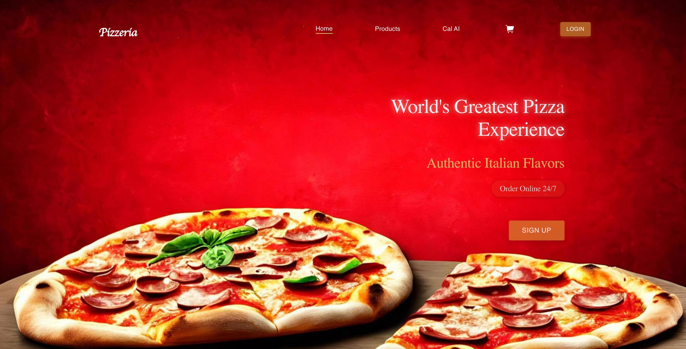
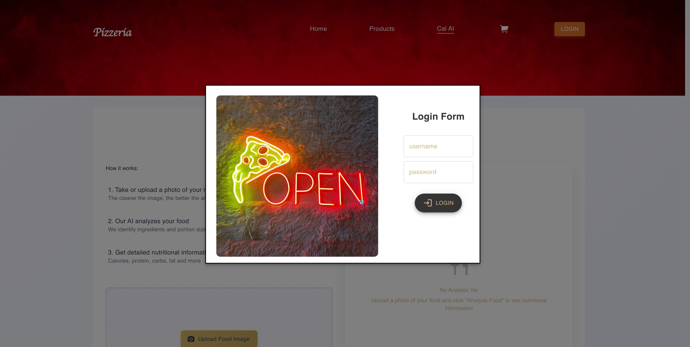
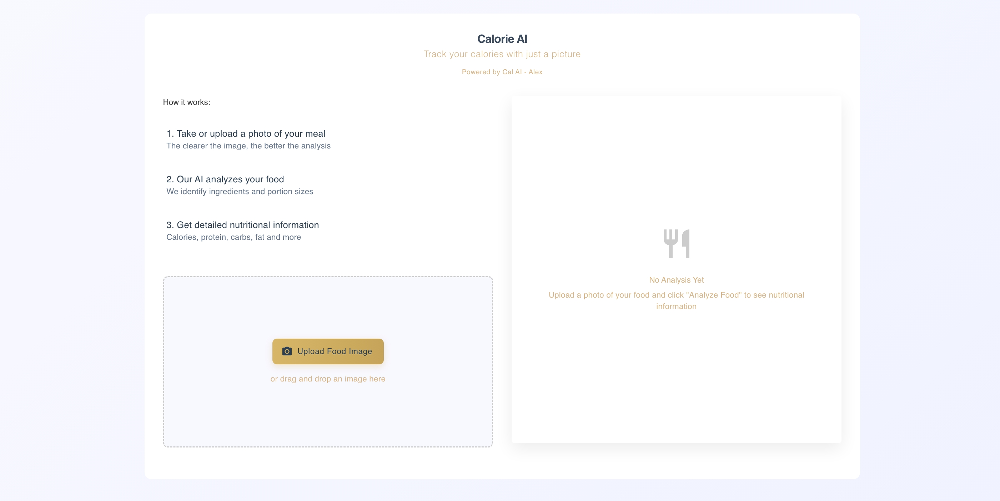

# Pizzeria Frontend 🍕

Welcome to the Pizzeria frontend application! This project provides the user interface for browsing products, managing orders, and user authentication for our online pizzeria.

This application is built with React, TypeScript, and utilizes Redux Toolkit for state management.

## Project Overview

This is a React web application built with TypeScript, likely bootstrapped using Create React App.

**Key Features & Structure:**

*   **Routing:** Uses `react-router-dom` to manage navigation between different pages.
*   **Pages/Screens:** The application includes the following main sections:
    *   `HomePage`: The main landing page.
    *   `ProductsPage`: Displays products, allowing users to add items to a cart.
    *   `OrdersPage`: Shows user orders.
    *   `UserPage`: A dedicated page for user-related information or actions.
    *   `CalAiPage`: A page related to "Cal AI".
*   **Components:** Reusable UI elements are organized within the `src/app/components` directory. This includes separate navigation bars (`HomeNavbar`, `OtherNavbar`) and a `Footer`.
*   **State Management:**
    *   A global state management solution is implemented using Redux Toolkit (`src/app/store.ts`) and a `useGlobals` hook.
    *   Local component state and custom hooks (`useBasket`, `useGlobals`) are also utilized.
*   **Shopping Cart:** The `useBasket` hook manages shopping cart functionality (adding, removing, deleting items).
*   **Authentication:** Handles user signup, login (via `AuthenticationModal`), and logout. A `MemberService` interacts with the backend API for authentication tasks.
*   **Styling:** Uses standard CSS files (`src/css`) and potentially a UI library like Material UI (indicated by `src/app/MaterialTheme`).
*   **Notifications:** Uses `sweetalert2` for user feedback messages.
*   **Services:** API interactions are handled in the `src/app/services` directory (e.g., `MemberService`).
*   **Testing:** Basic test setup is included (`setupTests.ts`, `App.test.tsx`).

## Tech Stack

*   **Framework:** React
*   **Language:** TypeScript
*   **State Management:** Redux Toolkit
*   **Routing:** React Router DOM
*   **Styling:** CSS (Potentially Material UI)
*   **Notifications:** SweetAlert2
*   **Build Tool:** Create React App (likely)

## Screenshots

**Main Page:**


**Login/Signup Modal:**


**Cal-AI Page:**


## Getting Started

### Prerequisites

*   Node.js (v16 or later recommended)
*   npm or yarn

### Installation

1.  Clone the repository:
    ```bash
    git clone <repository-url>
    cd Pizzeria-Front
    ```
2.  Install dependencies:
    ```bash
    npm install
    # or
    # yarn install
    ```

### Environment Variables

Create a `.env` file in the root directory and add any necessary environment variables (e.g., API endpoint):

```
REACT_APP_API_URL=http://your-backend-api-url
```

*(Note: Check `.env.example` if available, or consult project maintainers for required variables.)*

### Running the Application

*   **Development Mode:**
    ```bash
    npm start
    # or
    # yarn start
    ```
    This runs the app in development mode.
    Open [http://localhost:3000](http://localhost:3000) to view it in your browser.
The page will reload when you make changes.

*   **Running Tests:**
    ```bash
    npm test
    # or
    # yarn test
    ```
    Launches the test runner in interactive watch mode.

*   **Production Build:**
    ```bash
    npm run build
    # or
    # yarn build
    ```
    Builds the app for production to the `build` folder.
    It optimizes the build for the best performance.

## Project Structure

```
 Pizzeria-Front/
 ├── public/         # Static assets and index.html
 ├── src/
 │   ├── app/        # Core application logic
 │   │   ├── components/ # Reusable UI components
 │   │   ├── context/    # React context providers
 │   │   ├── hooks/      # Custom React hooks
 │   │   ├── screens/    # Page-level components
 │   │   ├── services/   # API service integrations
 │   │   ├── MaterialTheme/ # Material UI theme configuration
 │   │   ├── App.tsx     # Main application component with routing
 │   │   ├── store.ts    # Redux store configuration
 │   │   └── ...
 │   ├── assets/     # Images, fonts, etc.
 │   ├── css/        # Global CSS styles
 │   ├── lib/        # Utility functions, configurations
 │   ├── index.tsx   # Application entry point
 │   └── ...
 ├── .env            # Environment variables (create this)
 ├── .gitignore      # Git ignore rules
 ├── package.json    # Project dependencies and scripts
 ├── tsconfig.json   # TypeScript configuration
 └── README.md       # This file
```

## Learn More

*   [React Documentation](https://reactjs.org/)
*   [Create React App Documentation](https://facebook.github.io/create-react-app/docs/getting-started)
*   [Redux Toolkit Documentation](https://redux-toolkit.js.org/)
*   [TypeScript Documentation](https://www.typescriptlang.org/docs/)
*   [React Router Documentation](https://reactrouter.com/)

---
*This project was initially bootstrapped with Create React App.*
